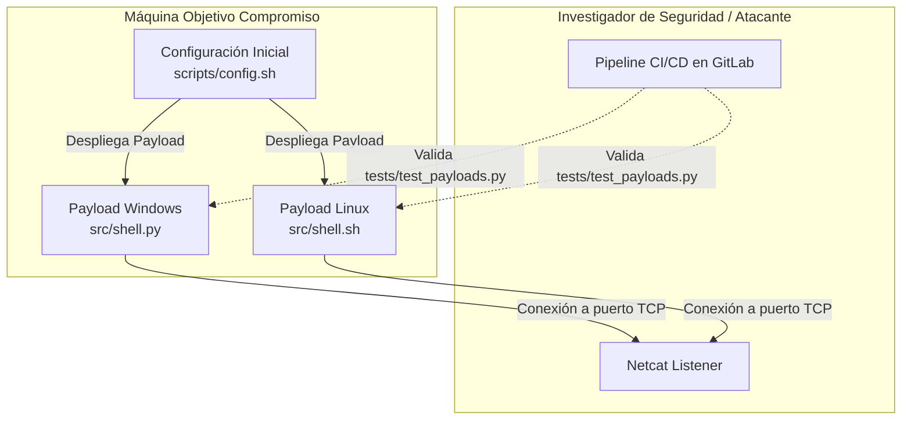

```mermaid
graph TD
    subgraph Atacante [Investigador de Seguridad / Atacante]
        A1[Netcat Listener]
        A2[Pipeline CI/CD en GitLab]
    end

    subgraph Objetivo [Máquina Objetivo Compromiso]
        O1[Configuración Inicial<br/>scripts/config.sh]
        O2[Payload Windows<br/>src/shell.py]
        O3[Payload Linux<br/>src/shell.sh]
    end

    O1 -- "Despliega Payload" --> O2
    O1 -- "Despliega Payload" --> O3
    
    O2 -- "Conexión a puerto TCP" --> A1
    O3 -- "Conexión a puerto TCP" --> A1

    A2 -. "Valida tests/test_payloads.py" .-> O2
    A2 -. "Valida tests/test_payloads.py" .-> O3
```
