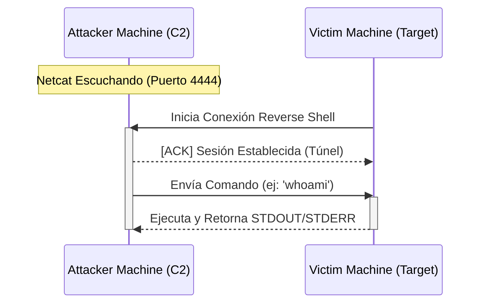

# Diagrama de Flujo de Conexión (Reverse Shell)

Este diagrama describe la interacción entre la máquina del atacante (C2) y la máquina víctima.

## Descripción del Proceso

1. **Escucha:** El atacante abre un puerto (`4444` por defecto) usando herramientas como `nc`.
2. **Conexión:** La víctima ejecuta el payload (`src/shell.py` o `src/shell.sh`) que busca activamente la IP del atacante.
3. **Control:** Una vez establecida la conexión de salida (egress), el atacante tiene control remoto sobre la terminal de la víctima.
