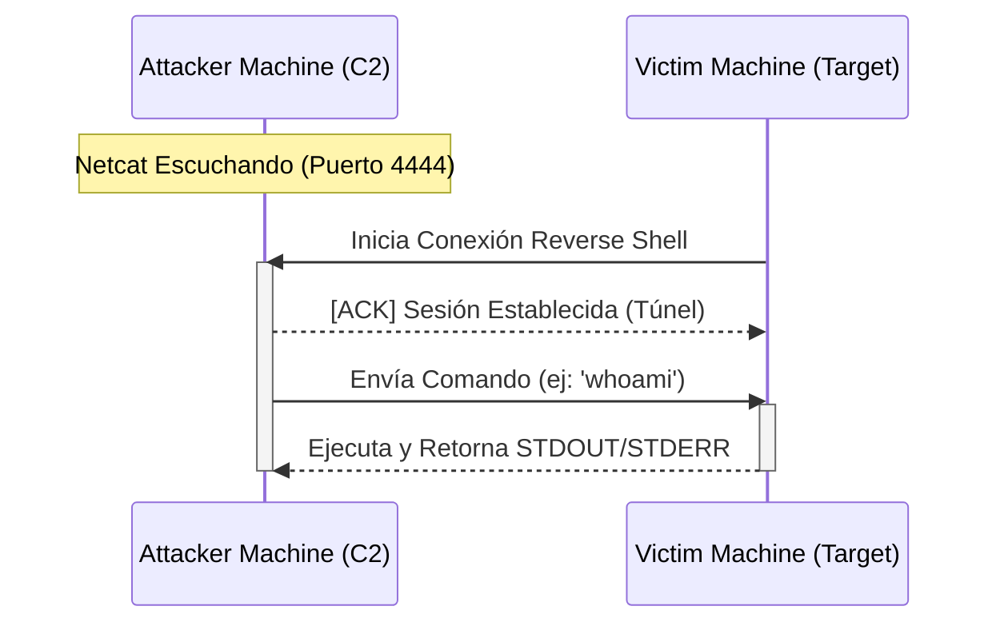

# Flujo de Conexión (Reverse Shell)

A continuación, se detalla el diagrama de secuencia que explica gráficamente cómo opera este Comando y Control (C2) de manera que se evada el bloqueo de tráfico de entrada comúnmente aplicado por firewalls perimetrales y puertas de enlace NAT.

